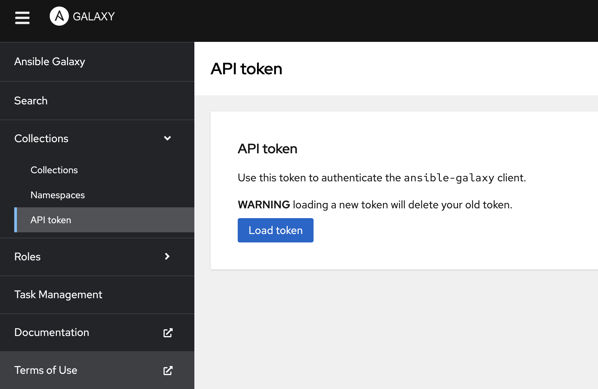
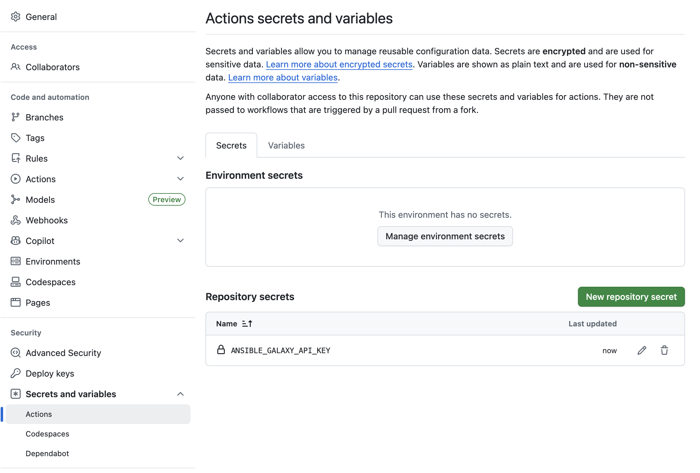

# Process to publish Ansible collection or playbook 

To publish a collection/playbook to the Cisco Ansible namespace [https://galaxy.ansible.com/ui/namespaces/cisco/](https://galaxy.ansible.com/ui/namespaces/cisco/) follow the process:

1. Create a private repo based on the Cisco DevNet template
2. Upload source code, add related headers to the source file:
   
`# Copyright 2025 Cisco Systems, Inc. and its affiliates`

`# SPDX-License-Identifier: Apache-2.0`

3. Edit template files and change `<project name>` to the repo name ref (e.g. `ansible-cisco-name`)
4. Complete the DevNet and OSPO review
5. DevNet can make the repo public
6. Login here https://galaxy.ansible.com/ using your related GitHub account and send your GitHub ID to DevNet
   
7. After adding you to the Cisco Ansible namespace, you can add your collection or playbook through Ansible Galaxy UI or from the command line using the `ansible-galaxy collection publish` command [documentation](https://docs.ansible.com/projects/ansible/devel/dev_guide/developing_collections_distributing.html#publishing-your-collection)

Note: Galaxy does not automatically pull in new versions. You'll need to either perform a manual upload via Galaxy UI/CLI when a new release takes place, or utilize a GitHub workflow to push the version to Galaxy after release. 
The Ansible Devtools team has some GitHub workflow templates available here that you can copy and utilize for this. 

You can generate your Ansible Galaxy API token here [https://galaxy.ansible.com/ui/token/](https://galaxy.ansible.com/ui/token/)

After you have added it as a Repository Secret in GitHub Actions.

In your GitHub repository, open:

Settings → Secrets and variables → Actions → Secrets

Click "New repository secret", then add Name `ANSIBLE_GALAXY_API_KEY` and then paste your previously generated Ansible Galaxy API in the `Secret` field.

