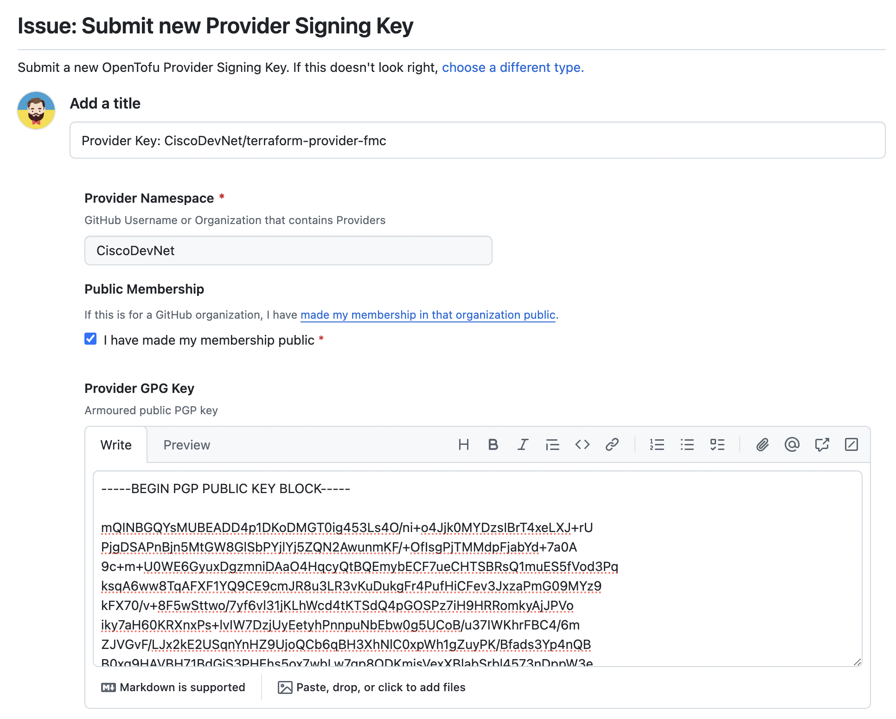

# Release Skeleton for Terraform/OpenTofu Providers and Modules via `CiscoDevNet`

A collection of files and instructions used to reduce the amount of time needed to publish net-new providers to Hashicorp's Terraform Registry.  Nothing contained in here differs dramatically from the instructions from Hashi (found [here](https://www.terraform.io/docs/registry/providers/publishing.html)), however, this repository contains some initial files to assist in the scaffolding of the new repository.

Most of the root skeleton files are pulled from [Hashicorp's repository](https://github.com/hashicorp/terraform-provider-scaffolding-framework) covering this topic.  However, in anecdotal experience, this repository can be overwhelming to those new to the process.  This repository is not meant as a replacement to the official repository, but meant as a barebones set of files and process to expedite the publishing process of new providers. 

[Tutorials, that can help to build a custom provider based on the new Terraform Plugin Framework](https://developer.hashicorp.com/terraform/tutorials/providers-plugin-framework)

The main steps of the process of publishing a Terraform Provider via Cisco DevNet looks like this:

1. Write, properly document, verify and test the Terraform Provider;
2. Migrate the repository to CiscoDevNet (if not already there);
3. Create GPG signing keys and securely share the public key with CiscoDevNet admin (most likely a Developer Advocate (DA));
4. Add the appropriate GoReleaser files (can be found in this repository and [here](https://github.com/hashicorp/terraform-provider-scaffolding-framework));
5. Notify the CiscoDevNet admin you are working for, after which it can be published to the Terraform Registry;
6. Share the Terraform Provider with the world! Have you created DevNet Learning Labs already? What about a Cisco Developer blog post? Contact your DA for more information about this!

## Included or Required Files

This repository contains several files to assist with the building of the provider when a release is generated.

### GPG Key

An ASCII-armored GPG key is required.  Raw keys are generally kept within each publishing Cisco Business Entity (BE), with the ASCII-armored export being added to the Terrform Registry under the CiscoDevNet organization.  You may need to work with your DA in order to add the key to the appropriate namespace. If you don't have an existing GPG key, you can [generate a new GPG key](https://docs.github.com/en/github/authenticating-to-github/managing-commit-signature-verification/generating-a-new-gpg-key) to use for signing commits and tags. See also [Terraform Registry. Generate GPG Signing Key](https://developer.hashicorp.com/terraform/tutorials/providers/provider-release-publish?in=terraform%2Fproviders#generate-gpg-signing-key)

From the actual GPG key, the armored version can be exported using:

```bash
gpg --armor --export "{KEY_ID}"
```

This key will need to be added to the GitHub repository under *Settings > Secrets*.  It should be added with the environment variable `GPG_PRIVATE_KEY` with any passphrase used added under the `PASSPHRASE` variable.

> Note: These environment variables can be changed, however, care must be taken to change the use of these variables in the associated files used within the GitHub action.

### goreleaser.yml

Use the included `goreleaser.yml` file into the root of the provider repository.  This file is used by the `goreleaser` container within the action to generate the packaged output files for each OS that can leverage the provider.  If the above ENV vars are changed, this file can remain in its current state

### release.yml

This file comprises the actions to be taken to generate the new files for each revision of the provider automatically, and will run with each new release generated from the GitHub web UI.  This file should be placed in the `.github/workflows/` directory of the provider repository.  If any of the environment variable names mentioned above are changed, these changes will need to be made in this file.

## Usage

Once the files are in place within the repository, a release can be created from the files within the repository.  This should kick off the action, which will take some time to run and the status can be viewed from the *Actions* tab of the GitHub web UI for that repository.  If a run is successfully completed, each of the packages for each OS will built.  This can be seen under the *Run GoReleaser* part of the action and the output assets can be viewed by clicking on the *Release*.  These files may take some time to populate within the release after running the action.  When all of the packages are listed under the release, the provider can then be published to Terraform Registry.

> Note: If the action completed successfully, but the OS specific builds and assets are not present in the release, the publish action within Terraform Registry will fail indicating that no assets are available.  If you encounter this, please wait until all files are present within the release and retry the publish action.

## Publishing the provider
Once all of the steps have been completed, the provider can then be published to Terraform Registry. For this to work an admin of the CiscoDevNet GitHub organization needs to log in to the Terraform Registry and publish. Please work with your DA or DevNet contact to do this and finalize the publishing process. 

# Publishing a Terraform Module
To [publish a module](https://www.terraform.io/registry/modules/publish), you need a lot less requirements, so the process should be fairly simple. Below are the requirements:

* **GitHub** The module must be on GitHub and must be a public repo. This is only a requirement for the public registry. If you're using a private registry, you may ignore this requirement.
* **Named** terraform-<PROVIDER>-<NAME>. Module repositories must use this three-part name format, where <NAME> reflects the type of infrastructure the module manages and <PROVIDER> is the main provider where it creates that infrastructure. The <NAME> segment can contain additional hyphens. Examples: `terraform-google-vault` or `terraform-aws-ec2-instance`.
* **Repository description** The GitHub repository description is used to populate the short description of the module. This should be a simple one sentence description of the module.
* **Standard module structure** The module must adhere to the standard module structure. This allows the registry to inspect your module and generate documentation, track resource usage, parse submodules and examples, and more.
* **`x.y.z` tags for releases** The registry uses tags to identify module versions. Release tag names must be a semantic version, which can optionally be prefixed with a `v`. For example, `v1.0.4` and `0.9.2`. To publish a module initially, at least one release tag must be present. Tags that don't look like version numbers are ignored.

Now to actually publish it, please browse to the [Terraform Registry](https://registry.terraform.io/), login with the `CiscoDevNet` authorized account, and select **Publish** and **Module** in the top right. Select the correct module from the drop down menu and click on **Publish Module**.

## OpenTofu
[OpenTofu](https://github.com/opentofu) is a fork of Terraform created as an initiative of Gruntwork, Spacelift, Harness, Env0, Scalr, and others, in response to HashiCorp’s switch from an open-source license to the BUSL. OpenTofu is open-source, community-driven, and managed by the Linux Foundation.


To submit new providers/modules to the OpenTofu Registry, please follow the following steps:

- To add the Provider or Module, it should be properly prepared and published as mentioned in this guide; you should be a member of a related Github organization like [CiscoDevnet](https://github.com/CiscoDevNet), [Cisco-Open](https://github.com/cisco-open), etc. If you are not a member, related DevNet folks can follow this process for you.

- [Changing the visibility of your organization membership from private to Public](https://docs.github.com/en/account-and-profile/setting-up-and-managing-your-personal-account-on-github/managing-your-membership-in-organizations/publicizing-or-hiding-organization-membership)

Add your Provider, Module or GPG key to the OpenTofu Registry by submiting an issue using one of the issue templates OpenTofu provide in their repository.

- [Submit new Module](https://github.com/opentofu/registry/issues/new?assignees=&labels=module%2Csubmission&projects=&template=module.yml&title=Module%3A+)
- [Submit new Provider](https://github.com/opentofu/registry/issues/new?assignees=&labels=provider%2Csubmission&projects=&template=provider.yml&title=Provider%3A+)
- [Submit new Provider Signing Key](https://github.com/opentofu/registry/issues/new?assignees=&labels=provider-key%2Csubmission&projects=&template=provider_key.yml&title=Provider+Key%3A+)

Copy your [GPG key](https://docs.github.com/en/authentication/managing-commit-signature-verification/generating-a-new-gpg-key), beginning with -----BEGIN PGP PUBLIC KEY BLOCK----- and ending with -----END PGP PUBLIC KEY BLOCK----- into the Provider GPG Key field.



Fill in the required fields and submit the issue. Once the issue has been submitted, the OpenTofu team will review it and either approve or deny the submission. It usually takes 1 to 24 hours.

